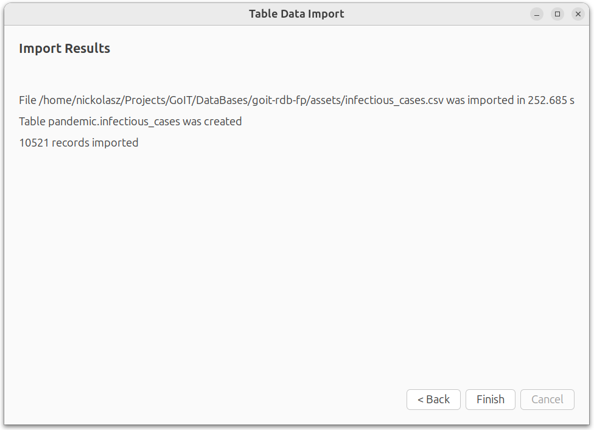
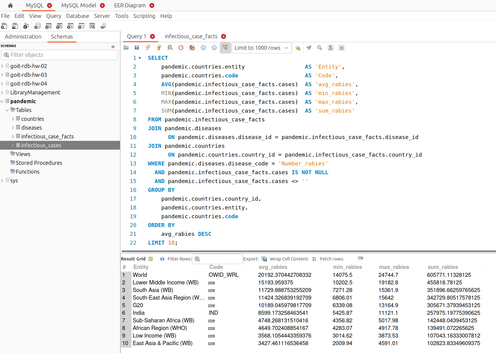

# [Фінальний проєкт з курсу Relational Databases](https://www.edu.goit.global/learn/25315460/21808779/22354713/homework)

## Опис фінального проєкту

1. Завантажте дані:
    - Створіть схему `pandemic` у базі даних за допомогою SQL-команди.
    - Оберіть її як схему за замовчуванням за допомогою SQL-команди.
    - Імпортуйте дані за допомогою `Import wizard` з файлу [infectious_cases.csv](./assets/infectious_cases.csv).
    - Продивіться дані, щоб бути у контексті.
2. Нормалізуйте таблицю `infectious_cases` до 3-ї нормальної форми. Збережіть у цій же схемі дві таблиці з нормалізованими даними. Виконайте запит `SELECT COUNT(*) FROM infectious_cases`, щоб ментор міг зрозуміти, скільки записів ви завантажили у базу даних із файлу.
3. Проаналізуйте дані:
    - Для кожної унікальної комбінації `Entity` та `Code` або їх `id` порахуйте середнє, мінімальне, максимальне значення та суму для атрибута `Number_rabies` (атрибут `Number_rabies` може містити порожні значення '' — попередньо необхідно їх відфільтрувати).
    - Результат відсортуйте за порахованим середнім значенням у порядку спадання.
    - Оберіть тільки 10 рядків для виведення на екран.
4. Побудуйте колонку різниці в роках. Для оригінальної або нормованої таблиці для колонки `Year` побудуйте з використанням вбудованих SQL-функцій:
    - атрибут, що створює дату першого січня відповідного року (наприклад, якщо атрибут містить значення `1996`, то значення нового атрибута має бути `1996-01-01`);
    - атрибут, що дорівнює поточній даті;
    - атрибут, що дорівнює різниці в роках двох вищезгаданих колонок.
5. Побудуйте власну функцію.
    - Створіть і використайте функцію, що будує такий же атрибут, як і в попередньому завданні: функція має приймати на вхід значення року, а повертати різницю в роках між поточною датою та датою, створеною з атрибута року (`1996 рік` → `1996-01-01`).

### Критерії прийняття
1. Прикріплені посилання на репозиторій `goit-rdb-fp` та безпосередньо самі файли репозиторію архівом.
2. Створено схему в базі даних. Імпортовано дані.
3. Таблицю нормалізовано.
4. Написано SQL-запити відповідно до заданих умов виконання. Запити виконуються й дають очікуваний результат, а саме:
    - середнє, мінімальне, максимальне значення та суму для атрибута `Number_rabies`. Виведення відбувається згідно із зазначеними вище вимогами за сортуванням та кількістю рядків;
    - колонку різниці в роках за допомогою вбудованих SQL-функцій;
    - функцію розрахунку різниці в роках або кількості захворювань за певний період. Функція повертає необхідні дані.

## Рішення

### 1. Завантажте дані
#### Створіть схему pandemic у базі даних за допомогою SQL-команди.

```sql
CREATE DATABASE IF NOT EXISTS pandemic
  DEFAULT CHARACTER SET utf8mb4
  DEFAULT COLLATE utf8mb4_unicode_ci;
USE pandemic;
```


#### Оберіть її як схему за замовчуванням за допомогою SQL-команди


#### Імпортуйте дані за допомогою Import wizard з файлу [infectious_cases.csv](./assets/infectious_cases.csv)


#### Продивіться дані, щоб бути у контексті


### 2. Нормалізуйте таблицю `infectious_cases` до 3-ї нормальної форми. Збережіть у цій же схемі дві таблиці з нормалізованими даними. Виконайте запит `SELECT COUNT(*) FROM infectious_cases`, щоб ментор міг зрозуміти, скільки записів ви завантажили у базу даних із файлу

```sql
SELECT COUNT(*) FROM infectious_cases`;
```


#### Довідник країн `countries`
```sql
USE pandemic;

DROP TABLE IF EXISTS pandemic.countries;
CREATE TABLE countries (
    country_id  INT AUTO_INCREMENT PRIMARY KEY,
    entity      VARCHAR(34)  NOT NULL,
    code        VARCHAR(8),
    CONSTRAINT uc_country UNIQUE (entity)
) ENGINE = InnoDB;

INSERT INTO countries (entity, code)
SELECT DISTINCT
       TRIM(Entity)                       AS 'entity',
       NULLIF(TRIM(Code), '')             AS 'code'
FROM infectious_cases;
```

#### Довідник інфекцій `diseases`

```sql
USE pandemic;

DROP TABLE IF EXISTS pandemic.diseases;
CREATE TABLE diseases (
    disease_id   SMALLINT AUTO_INCREMENT PRIMARY KEY,
    disease_code VARCHAR(32) NOT NULL UNIQUE,
    disease_name VARCHAR(64) NOT NULL,
    description  TEXT NULL
) ENGINE = InnoDB;

INSERT INTO diseases (disease_code, disease_name, description)
VALUES
  ('Number_yaws' , 'Yaws', 'Yaws — хронічна бактеріальна інфекція (Treponema pallidum pertenue). Типові симптоми: безболісні шкірні виразки («м’ясисті» папули), пізніше – ураження кісток і хрящів, деформації кінцівок.'),
  ('polio_cases', 'Poliomyelitis', 'Поліомієліт — вірусне захворювання (Enterovirus). Часто безсимптомний; можливі лихоманка, біль у горлі, м’язова слабкість. У ≈1 % випадків розвивається гострий в’ялий параліч.'),
  ('cases_guinea_worm', 'Guinea-worm disease', 'Дракункульоз (Guinea-worm) — паразитарна інфекція (Dracunculus medinensis). Симптоми: свербіж і печіння, болісний пухир (зазвичай на ногах), з якого виходить черв’як; можливі гарячка, нудота.'),
  ('Number_rabies', 'Rabies', 'Сказ — смертельна вірусна енцефалітна інфекція (Lyssavirus). Спершу підвищення температури та поколювання у місці укусу, далі – тривога, гідрофобія, спазми м’язів горла, параліч, кома.'),
  ('Number_malaria', 'Malaria', 'Малярія — паразитарне захворювання (Plasmodium spp.). Типові симптоми: циклічна лихоманка з ознобом і потом, головний біль, анемія, збільшення селезінки. Важкі форми – органна недостатність.'),
  ('Number_hiv', 'HIV', 'ВІЛ-інфекція — ретровірус, що уражає CD4-клітини. На початку – грипоподібний синдром; тривалий безсимптомний період. При прогресуванні (СНІД) — опортуністичні інфекції, схуднення, пухлини.'),
  ('Number_tuberculosis', 'Tuberculosis', 'Туберкульоз — бактеріальна інфекція (Mycobacterium tuberculosis). Симптоми: затяжний кашель (часто з кров’ю), нічна пітливість, невмотивована втома, зниження ваги, субфебрилітет.'),
  ('Number_smallpox', 'Smallpox', 'Віспа (Smallpox) — вірус Variola (нині ліквідований). Класичні прояви: раптова висока гарячка, головний біль, висип-пустули, що переходять у скоринки та залишають рубці.'),
  ('Number_cholera_cases', 'Cholera', 'Холера — гостра діарейна інфекція (Vibrio cholerae). Ключовий симптом: раптовий водянистий пронос “рисовий відвар”, блювання, швидке зневоднення та електролітні порушення.');
```

#### Таблиця реєстру випадків `infectious_case_facts`

```sql
USE pandemic;

DROP TABLE IF EXISTS pandemic.infectious_case_facts;
CREATE TABLE infectious_case_facts (
    country_id  INT        NOT NULL,
    year        YEAR       NOT NULL,
    disease_id  SMALLINT   NOT NULL,
    cases       FLOAT          NULL,
    PRIMARY KEY (country_id, year, disease_id),
    CONSTRAINT fk_icf_country  FOREIGN KEY (country_id)
               REFERENCES countries(country_id)
               ON DELETE CASCADE,
    CONSTRAINT fk_icf_disease  FOREIGN KEY (disease_id)
               REFERENCES diseases(disease_id)
               ON DELETE CASCADE
) ENGINE = InnoDB;
```

#### Перенесення даних

```sql
START TRANSACTION;

INSERT INTO infectious_case_facts (country_id, year, disease_id, cases)
SELECT  c.country_id,
        ic.Year,
        d.disease_id,
        ic.Number_yaws AS cases
FROM infectious_cases ic
JOIN countries c  ON c.entity = ic.Entity
JOIN diseases  d  ON d.disease_code = 'Number_yaws'
WHERE ic.Number_yaws != ""

UNION ALL
SELECT  c.country_id, ic.Year, d.disease_id, ic.polio_cases
FROM infectious_cases ic
JOIN countries c ON c.entity = ic.Entity
JOIN diseases  d ON d.disease_code = 'polio_cases'
WHERE ic.polio_cases != ""

UNION ALL
SELECT  c.country_id, ic.Year, d.disease_id, ic.cases_guinea_worm
FROM infectious_cases ic
JOIN countries c ON c.entity = ic.Entity
JOIN diseases  d ON d.disease_code = 'cases_guinea_worm'
WHERE ic.cases_guinea_worm != ""

UNION ALL
SELECT  c.country_id, ic.Year, d.disease_id, ic.Number_rabies
FROM infectious_cases ic
JOIN countries c ON c.entity = ic.Entity
JOIN diseases  d ON d.disease_code = 'Number_rabies'
WHERE ic.Number_rabies != ""

UNION ALL
SELECT  c.country_id, ic.Year, d.disease_id, ic.Number_malaria
FROM infectious_cases ic
JOIN countries c ON c.entity = ic.Entity
JOIN diseases  d ON d.disease_code = 'Number_malaria'
WHERE ic.Number_malaria != ""

UNION ALL
SELECT  c.country_id, ic.Year, d.disease_id, ic.Number_hiv
FROM infectious_cases ic
JOIN countries c ON c.entity = ic.Entity
JOIN diseases  d ON d.disease_code = 'Number_hiv'
WHERE ic.Number_hiv != ""

UNION ALL
SELECT  c.country_id, ic.Year, d.disease_id, ic.Number_tuberculosis
FROM infectious_cases ic
JOIN countries c ON c.entity = ic.Entity
JOIN diseases  d ON d.disease_code = 'Number_tuberculosis'
WHERE ic.Number_tuberculosis != ""

UNION ALL
SELECT  c.country_id, ic.Year, d.disease_id, ic.Number_smallpox
FROM infectious_cases ic
JOIN countries c ON c.entity = ic.Entity
JOIN diseases  d ON d.disease_code = 'Number_smallpox'
WHERE ic.Number_smallpox != ""

UNION ALL
SELECT  c.country_id, ic.Year, d.disease_id, ic.Number_cholera_cases
FROM infectious_cases ic
JOIN countries c ON c.entity = ic.Entity
JOIN diseases  d ON d.disease_code = 'Number_cholera_cases'
WHERE ic.Number_cholera_cases != "";

COMMIT;
```

#### EER Diagram


[pandemic.mwb](./assets/pandemic.mwb)

### 3. Проаналізуйте дані

- Для кожної унікальної комбінації `Entity` та `Code` або їх `id` порахуйте середнє, мінімальне, максимальне значення та суму для атрибута `Number_rabies` (атрибут `Number_rabies` може містити порожні значення '' — попередньо необхідно їх відфільтрувати).
- Результат відсортуйте за порахованим середнім значенням у порядку спадання.
- Оберіть тільки 10 рядків для виведення на екран.

*Після нормалізації таблиць та перенесення даних в таблиці немає значень `NULL`. `NULL` - означає, що даних не було надано, при цьому `0` - означає, що згідно наданих даних зареєстованих випадків не було. Відповідно немає потреби в додатковій перевірці `AND pandemic.infectious_case_facts.cases IS NOT NULL AND pandemic.infectious_case_facts.cases <> ''` (в коді залишено для наочності).*


```sql
SELECT
    pandemic.countries.entity                  AS 'Entity',
    pandemic.countries.code                    AS 'Code',
    AVG(pandemic.infectious_case_facts.cases)  AS 'avg_rabies',
    MIN(pandemic.infectious_case_facts.cases)  AS 'min_rabies',
    MAX(pandemic.infectious_case_facts.cases)  AS 'max_rabies',
    SUM(pandemic.infectious_case_facts.cases)  AS 'sum_rabies'
FROM pandemic.infectious_case_facts
JOIN pandemic.diseases
      ON pandemic.diseases.disease_id = pandemic.infectious_case_facts.disease_id
JOIN pandemic.countries
      ON pandemic.countries.country_id = pandemic.infectious_case_facts.country_id
WHERE pandemic.diseases.disease_code = 'Number_rabies'
  AND pandemic.infectious_case_facts.cases IS NOT NULL
  AND pandemic.infectious_case_facts.cases <> ''
GROUP BY
    pandemic.countries.country_id,
    pandemic.countries.entity,
    pandemic.countries.code
ORDER BY
    avg_rabies DESC
LIMIT 10;    
```



### 4. Побудуйте колонку різниці в роках. Для оригінальної або нормованої таблиці для колонки `Year` побудуйте з використанням вбудованих SQL-функцій:
    
- атрибут, що створює дату першого січня відповідного року (наприклад, якщо атрибут містить значення `1996`, то значення нового атрибута має бути `1996-01-01`);
- атрибут, що дорівнює поточній даті;
- атрибут, що дорівнює різниці в роках двох вищезгаданих колонок.

```sql
SELECT
    pandemic.infectious_case_facts.country_id,
    pandemic.infectious_case_facts.`year`                                                                              AS 'year',
    STR_TO_DATE(CONCAT(pandemic.infectious_case_facts.`year`, '-01-01'), '%Y-%m-%d')                                   AS 'first_jan_date',
    CURDATE()                                                                                                          AS 'current_date',
    TIMESTAMPDIFF(YEAR, STR_TO_DATE(CONCAT(pandemic.infectious_case_facts.`year`, '-01-01'), '%Y-%m-%d'), CURDATE())   AS 'diff_years'
FROM pandemic.infectious_case_facts;
```


### 5. Побудуйте власну функцію

- Створіть і використайте функцію, що будує такий же атрибут, як і в попередньому завданні: функція має приймати на вхід значення року, а повертати різницю в роках між поточною датою та датою, створеною з атрибута року (`1996 рік` → `1996-01-01`)

```sql
DROP FUNCTION IF EXISTS pandemic.diff_years_from_year;
DELIMITER //
CREATE FUNCTION pandemic.diff_years_from_year(p_year INT)
RETURNS INT
DETERMINISTIC
BEGIN
    RETURN TIMESTAMPDIFF(YEAR, STR_TO_DATE(CONCAT(p_year, '-01-01'), '%Y-%m-%d'), CURDATE());
END //
DELIMITER ;

SELECT
    pandemic.infectious_case_facts.country_id,
    pandemic.infectious_case_facts.`year`                                               AS 'year',
    STR_TO_DATE(CONCAT(pandemic.infectious_case_facts.`year`, '-01-01'), '%Y-%m-%d')    AS 'first_jan_date',
    CURDATE()                                                                           AS 'current_date',
 pandemic.diff_years_from_year(pandemic.infectious_case_facts.`year`)                   AS 'diff_years'
FROM pandemic.infectious_case_facts;
```


## Dump

[dump.sql](./init-scripts/dump.sql)

## Репозиторій
[goit-rdb-fp](https://github.com/nickolas-z/goit-rdb-fp)
